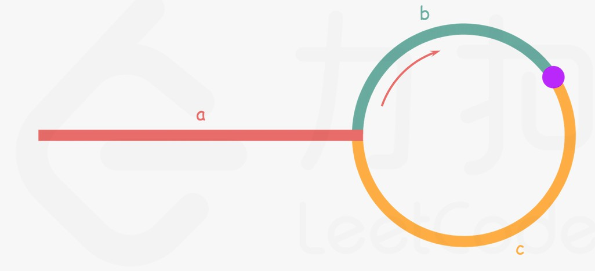

## [142. Linked List Cycle II](https://leetcode.com/problems/linked-list-cycle-ii/)


Given the `head` of a linked list, return _the node where the cycle begins. If there is no cycle, return_ `null`.

There is a cycle in a linked list if there is some node in the list that can be reached again by continuously following the `next` pointer. Internally, `pos` is used to denote the index of the node that tail's `next` pointer is connected to (**0-indexed**). It is `-1` if there is no cycle. **Note that** `pos` **is not passed as a parameter**.

**Do not modify** the linked list.

**Example 1:**


```
Input: head = [3,2,0,-4], pos = 1
Output: tail connects to node index 1
Explanation: There is a cycle in the linked list, where tail connects to the second node.
```

**Example 2:**


```
Input: head = [1,2], pos = 0
Output: tail connects to node index 0
Explanation: There is a cycle in the linked list, where tail connects to the first node.
```

**Example 3:**


```
Input: head = [1], pos = -1
Output: no cycle
Explanation: There is no cycle in the linked list.
```

**Constraints:**

*   The number of the nodes in the list is in the range <code>[0, 10<sup>4</sup>]</code>.
*   <code>-10<sup>5</sup> <= Node.val <= 10<sup>5</sup></code>
*   `pos` is `-1` or a **valid index** in the linked-list.

**Follow up:** Can you solve it using `O(1)` (i.e. constant) memory?


## Solution

- HashMap:	$Space: O(n)$ 

```go
/**
 * Definition for singly-linked list.
 * type ListNode struct {
 *     Val int
 *     Next *ListNode
 * }
 */
func detectCycle(head *ListNode) *ListNode {
    seen := make(map[*ListNode]bool)
    for p := head; p != nil; p = p.Next {
        if seen[p] {
            return p
        }
        seen[p] = true
    }
    return nil
}
```

- Fast & Slow Pointers:	$Space: O(1)$ 

```go
func detectCycle(head *ListNode) *ListNode {
    slow, fast := head, head
    for {
        if fast == nil || fast.Next == nil {
            return nil
        }
        slow = slow.Next
        fast = fast.Next.Next
        if slow == fast {
            break
        }
    }

    fast = head
    for slow != fast {
        slow = slow.Next
        fast = fast.Next
    }
    return fast
}
```

Proof:



Let $n$ be the size of the cycle, then $n = b + c$ 

Upon first meet, the distance of `slow` pointer is $a + k_1n + b$ , and distance of `fast` pointer is $a + k_2n + b$ .

$D_{fast} = 2D_{slow}$ , that is

$a + k_2n +b = 2(a + k_1n + b)$ .

$a = (k_2 - 2k_1)n - b$ 

$a = (k_2 - 2k_1)n - (n - c)$ 

$a = (k_2 - 2k_1 - 1)n + c$ 

Let $k = (k_2 - 2k_1 - 1)$ , then

$a = kn + c$ 

That's why after two pointers meet we have `fast` pointer start from `head` and move at the same pace with `slow`. Their second meet must be at the node where the cycle begins.