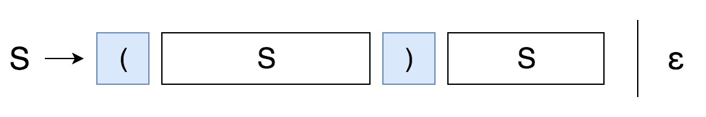

## [22. Generate Parentheses](https://leetcode.com/problems/generate-parentheses/)


Given `n` pairs of parentheses, write a function to _generate all combinations of well-formed parentheses_.

**Example 1:**

```
Input: n = 3
Output: ["((()))","(()())","(())()","()(())","()()()"]
```

**Example 2:**

```
Input: n = 1
Output: ["()"]
```

**Constraints:**

*   `1 <= n <= 8`


## Solution

- Backtracking

```go
func generateParenthesis(n int) []string {
    var result []string
    helper(n, n, "", &result)
    return result
}

// open: # of open parentheses
// close: # of close parentheses
func helper(open, close int, prefix string, result *[]string) {
    if open == 0 && close == 0 {
        *result = append(*result, prefix)
        return
    }

    if open > 0 {
        helper(open-1, close, prefix+"(", result)
    }
    if close > open {
        helper(open, close-1, prefix+")", result)
    }
}
```


- Closure Number



```go
// Grammar: S -> (S)S | ε
func generateParenthesis(n int) []string {
	var result []string
	if n == 0 {
		result = append(result, "")
		return result
	}

	for i := 0; i < n; i++ {
		for _, left := range generateParenthesis(i) {
			for _, right := range generateParenthesis(n-1-i) {
				s := "(" + left + ")" + right
				result = append(result, s)
			}
		}
	}
	return result
}
```

