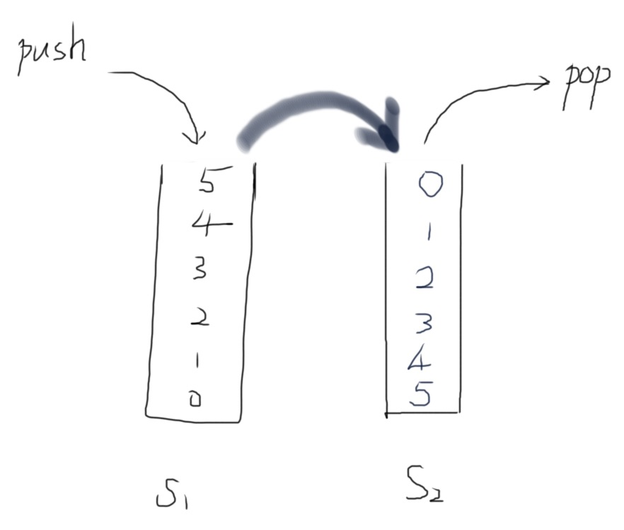

## [232. Implement Queue using Stacks](https://leetcode.com/problems/implement-queue-using-stacks/)


Implement a first in first out (FIFO) queue using only two stacks. The implemented queue should support all the functions of a normal queue (`push`, `peek`, `pop`, and `empty`).

Implement the `MyQueue` class:

*   `void push(int x)` Pushes element x to the back of the queue.
*   `int pop()` Removes the element from the front of the queue and returns it.
*   `int peek()` Returns the element at the front of the queue.
*   `boolean empty()` Returns `true` if the queue is empty, `false` otherwise.

**Notes:**

*   You must use **only** standard operations of a stack, which means only `push to top`, `peek/pop from top`, `size`, and `is empty` operations are valid.
*   Depending on your language, the stack may not be supported natively. You may simulate a stack using a list or deque (double-ended queue) as long as you use only a stack's standard operations.

**Example 1:**

```
Input
["MyQueue", "push", "push", "peek", "pop", "empty"]
[[], [1], [2], [], [], []]
Output
[null, null, null, 1, 1, false]

Explanation
MyQueue myQueue = new MyQueue();
myQueue.push(1); // queue is: [1]
myQueue.push(2); // queue is: [1, 2] (leftmost is front of the queue)
myQueue.peek(); // return 1
myQueue.pop(); // return 1, queue is [2]
myQueue.empty(); // return false
```

**Constraints:**

*   `1 <= x <= 9`
*   At most `100` calls will be made to `push`, `pop`, `peek`, and `empty`.
*   All the calls to `pop` and `peek` are valid.

**Follow-up:** Can you implement the queue such that each operation is `O(1)` time complexity? In other words, performing `n` operations will take overall `O(n)` time even if one of those operations may take longer.


## Idea

【负负得正】

- Always push to `stack1` .
- Always pop from `stack2` . But in case `stack2` is empty, move all elements from `stack1` to `stack2` then pop again. (Same logic with "Peek()" and "Size()" functions)




## Solution

```go
type MyQueue struct {
    inStack, outStack Stack
}


func Constructor() MyQueue {
    return MyQueue{}
}


func (this *MyQueue) Push(x int)  {
    // push to inStack
    this.inStack.Push(x)
}


func (this *MyQueue) in2out() {
    for (len(this.inStack) > 0) {
        this.outStack.Push(this.inStack.Pop())
    }
}


func (this *MyQueue) Pop() int {
    // when outStack is empty, move all elements from inStack to outStack
    if (len(this.outStack) == 0) {
        this.in2out()
    }
    // pop from outStack
    return this.outStack.Pop()
}


func (this *MyQueue) Peek() int {
    // when outStack is empty, move all elements from inStack to outStack
    if (len(this.outStack) == 0) {
        this.in2out()
    }
    return this.outStack.Peek()
}


func (this *MyQueue) Empty() bool {
    return len(this.inStack) == 0 && len(this.outStack) == 0
}


// stack type definition
type Stack []int

func (s *Stack) Push(x int) {
	*s = append(*s, x)
}

func (s *Stack) Pop() int {
	n := len(*s)
	top := (*s)[n-1]
	*s = (*s)[:n-1]
	return top
}

func (s *Stack) Peek() int {
	n := len(*s)
	return (*s)[n-1]
}


/**
 * Your MyQueue object will be instantiated and called as such:
 * obj := Constructor();
 * obj.Push(x);
 * param_2 := obj.Pop();
 * param_3 := obj.Peek();
 * param_4 := obj.Empty();
 */
```