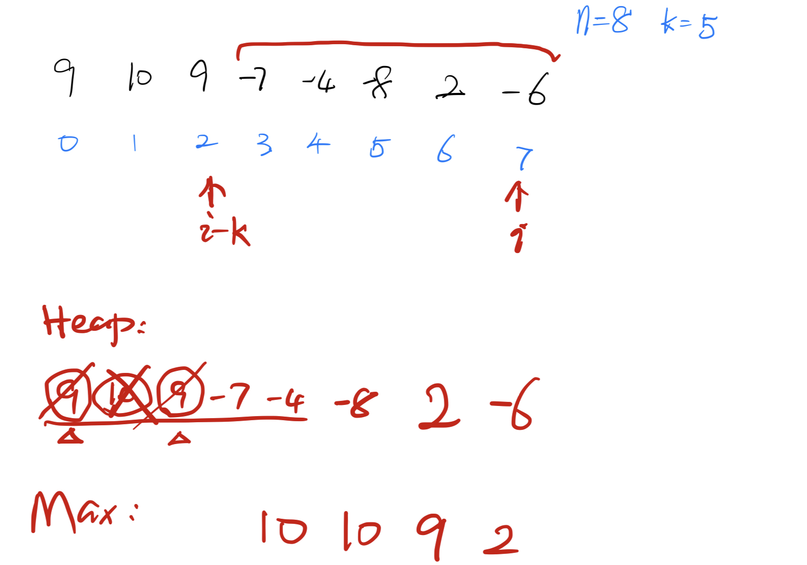

## [239. Sliding Window Maximum](https://leetcode.com/problems/sliding-window-maximum/)


You are given an array of integers `nums`, there is a sliding window of size `k` which is moving from the very left of the array to the very right. You can only see the `k` numbers in the window. Each time the sliding window moves right by one position.

Return _the max sliding window_.

**Example 1:**

```
Input: nums = [1,3,-1,-3,5,3,6,7], k = 3
Output: [3,3,5,5,6,7]
Explanation: 
Window position                Max
---------------               -----
[1  3  -1] -3  5  3  6  7       3
 1 [3  -1  -3] 5  3  6  7       3
 1  3 [-1  -3  5] 3  6  7       5
 1  3  -1 [-3  5  3] 6  7       5
 1  3  -1  -3 [5  3  6] 7       6
 1  3  -1  -3  5 [3  6  7]      7
```

**Example 2:**

```
Input: nums = [1], k = 1
Output: [1]
```

**Constraints:**

*   <code>1 <= nums.length <= 10<sup>5</sup></code>
*   <code>-10<sup>4</sup> <= nums[i] <= 10<sup>4</sup></code>
*   `1 <= k <= nums.length`


## Solution

- Brute-force	$Time: O(n^2), Space: O(1)$ 	(Time Limit Exceeded)

```go
func maxSlidingWindow(nums []int, k int) []int {
    n := len(nums)
    var result []int
    for i := 0; i <= n-k; i++ {
        mx := nums[i]
        for j := i; j < i+k; j++ {
            mx = max(mx, nums[j])
        }
        result = append(result, mx)
    }
    return result
}
```


- Max-Heap	$Time: O(nlogn), Space: O(n)$ 

> Note: the heap is initially of size k, but it may include more (or less) numbers as the window moves.

```go
func maxSlidingWindow(nums []int, k int) []int {
    A = nums
    h := &Heap{make([]int, k)}
    // init heap with indexes of first k elements
    for i := 0; i < k; i++ {
        h.IntSlice[i] = i
    }
    heap.Init(h)

    n := len(nums)
    result := make([]int, 0, n-k+1)
    result = append(result, nums[h.IntSlice[0]])

    for i := k; i < n; i++ {
        // extend the window
        heap.Push(h, i)
        for h.IntSlice[0] <= i-k {
            heap.Pop(h)
        }
        result = append(result, nums[h.IntSlice[0]])
    }
    return result
}


var A []int

// MaxHeap -- stores indexes of nums
type Heap struct {
    sort.IntSlice
}

func (h Heap) Less(i, j int) bool {
    ii, ij := h.IntSlice[i], h.IntSlice[j]
    return A[ii] > A[ij]
}

func (h *Heap) Push(x any) {
    h.IntSlice = append(h.IntSlice, x.(int))
}

func (h *Heap) Pop() any {
    a := h.IntSlice
    top := a[len(a)-1]
    h.IntSlice = a[:len(a)-1]
    return top
}
```

An example walk-through:




- Monotonic Queue	$Time: O(n), Space: O(k)$ 

```go

```

