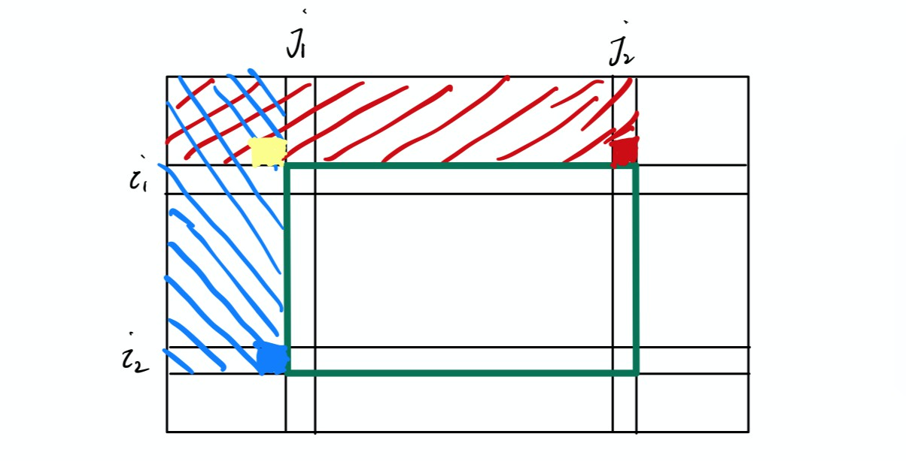

## [304. Range Sum Query 2D - Immutable](https://leetcode.com/problems/range-sum-query-2d-immutable/)


Given a 2D matrix `matrix`, handle multiple queries of the following type:

*   Calculate the **sum** of the elements of `matrix` inside the rectangle defined by its **upper left corner** `(row1, col1)` and **lower right corner** `(row2, col2)`.

Implement the `NumMatrix` class:

*   `NumMatrix(int[][] matrix)` Initializes the object with the integer matrix `matrix`.
*   `int sumRegion(int row1, int col1, int row2, int col2)` Returns the **sum** of the elements of `matrix` inside the rectangle defined by its **upper left corner** `(row1, col1)` and **lower right corner** `(row2, col2)`.

You must design an algorithm where `sumRegion` works on `O(1)` time complexity.

**Example 1:**


```
Input
["NumMatrix", "sumRegion", "sumRegion", "sumRegion"]
[[[[3, 0, 1, 4, 2], [5, 6, 3, 2, 1], [1, 2, 0, 1, 5], [4, 1, 0, 1, 7], [1, 0, 3, 0, 5]]], [2, 1, 4, 3], [1, 1, 2, 2], [1, 2, 2, 4]]
Output
[null, 8, 11, 12]

Explanation
NumMatrix numMatrix = new NumMatrix([[3, 0, 1, 4, 2], [5, 6, 3, 2, 1], [1, 2, 0, 1, 5], [4, 1, 0, 1, 7], [1, 0, 3, 0, 5]]);
numMatrix.sumRegion(2, 1, 4, 3); // return 8 (i.e sum of the red rectangle)
numMatrix.sumRegion(1, 1, 2, 2); // return 11 (i.e sum of the green rectangle)
numMatrix.sumRegion(1, 2, 2, 4); // return 12 (i.e sum of the blue rectangle)
```

**Constraints:**

*   `m == matrix.length`
*   `n == matrix[i].length`
*   `1 <= m, n <= 200`
*   <code>-10<sup>4</sup> <= matrix[i][j] <= 10<sup>4</sup></code>
*   `0 <= row1 <= row2 < m`
*   `0 <= col1 <= col2 < n`
*   At most <code>10<sup>4</sup></code> calls will be made to `sumRegion`.


## Solution

```go
// S(i, j): sum of numbers A[0..i)[0..j) exclusive
// S(i, j) = A[i-1][j-1] + S(i-1, j) + S(i, j-1) - S(i-1, j-1)
type NumMatrix struct {
    sums [][]int
}

func Constructor(A [][]int) NumMatrix {
    m, n := len(A), len(A[0])
    sums := make([][]int, m+1)
    for i := range sums {
        sums[i] = make([]int, n+1)
    }
    
    for i := 1; i <= m; i++ {
        for j := 1; j <= n; j++ {
            sums[i][j] = A[i-1][j-1] + sums[i-1][j] + sums[i][j-1] - sums[i-1][j-1]
        }
    }
    return NumMatrix{sums}
}

func (nm *NumMatrix) SumRegion(row1 int, col1 int, row2 int, col2 int) int {
    i1, j1, i2, j2 := row1+1, col1+1, row2+1, col2+1
    S := nm.sums
    return S[i2][j2] - S[i1-1][j2] - S[i2][j1-1] + S[i1-1][j1-1]
}

/**
 * Your NumMatrix object will be instantiated and called as such:
 * obj := Constructor(matrix);
 * param_1 := obj.SumRegion(row1,col1,row2,col2);
 */
```



