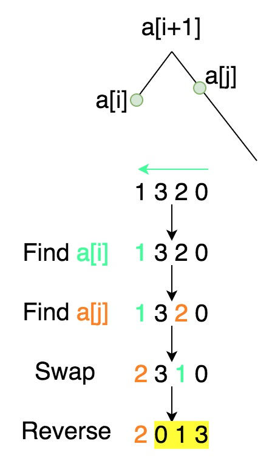

## [31. Next Permutation](https://leetcode.com/problems/next-permutation/)


A **permutation** of an array of integers is an arrangement of its members into a sequence or linear order.

*   For example, for `arr = [1,2,3]`, the following are considered permutations of `arr`: `[1,2,3]`, `[1,3,2]`, `[3,1,2]`, `[2,3,1]`.

The **next permutation** of an array of integers is the next lexicographically greater permutation of its integer. More formally, if all the permutations of the array are sorted in one container according to their lexicographical order, then the **next permutation** of that array is the permutation that follows it in the sorted container. If such arrangement is not possible, the array must be rearranged as the lowest possible order (i.e., sorted in ascending order).

*   For example, the next permutation of `arr = [1,2,3]` is `[1,3,2]`.
*   Similarly, the next permutation of `arr = [2,3,1]` is `[3,1,2]`.
*   While the next permutation of `arr = [3,2,1]` is `[1,2,3]` because `[3,2,1]` does not have a lexicographical larger rearrangement.

Given an array of integers `nums`, _find the next permutation of_ `nums`.

The replacement must be and use only constant extra memory.

**Example 1:**

```
Input: nums = [1,2,3]
Output: [1,3,2]
```

**Example 2:**

```
Input: nums = [3,2,1]
Output: [1,2,3]
```

**Example 3:**

```
Input: nums = [1,1,5]
Output: [1,5,1]
```

**Constraints:**

*   `1 <= nums.length <= 100`
*   `0 <= nums[i] <= 100`


## Idea

Take 123 for example, all its permutations are 123, 132, 213, 231, 312, 321. If input is 123 then return 132; if input is 321 then return 123.

- from right to left, find first i that A[i] < A[i+1]
- from right to left, find first j that A[j] > A[i]
- swap A[i] and A[j]. Since A[i+1:] is in descending order, so reverse it to minimize its value.




## Solution

- $Time: O(n), Space: O(1)$ 

```go
func nextPermutation(nums []int) {
    n := len(nums)
    
    // from right to left, find first i that A[i] < A[i+1]
    i := n-2
    for i >= 0 && nums[i] >= nums[i+1] {
        i--
    }

    // the array is in descending order, e.g. [4,3,2,1]
    if i == -1 {
        reverse(nums)
        return
    }

    // from right to left, find first j that A[j] > A[i]
    j := n-1
    for nums[j] <= nums[i] {
        j--
    }
    // swap A[i] and A[j]
    nums[i], nums[j] = nums[j], nums[i]
    // A[i+1:] is in descending order, so reverse it to minimize its value
    reverse(nums[i+1:])
}

func reverse(A []int) {
    n := len(A)
    for i := 0; i < n/2; i++ {
        A[i], A[n-1-i] = A[n-1-i], A[i]
    }
}
```