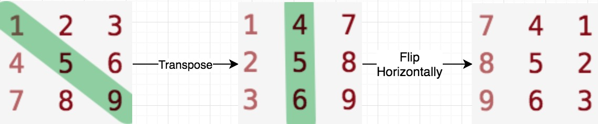
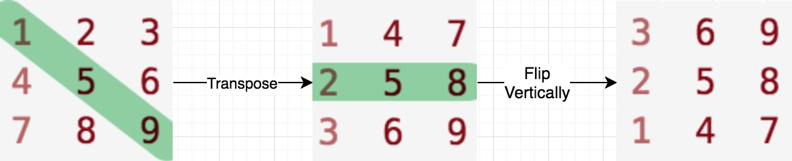

## [48. Rotate Image](https://leetcode.com/problems/rotate-image/)


You are given an `n x n` 2D `matrix` representing an image, rotate the image by **90** degrees (clockwise).

You have to rotate the image , which means you have to modify the input 2D matrix directly. **DO NOT** allocate another 2D matrix and do the rotation.

**Example 1:**


```
Input: matrix = [[1,2,3],[4,5,6],[7,8,9]]
Output: [[7,4,1],[8,5,2],[9,6,3]]
```

**Example 2:**


```
Input: matrix = [[5,1,9,11],[2,4,8,10],[13,3,6,7],[15,14,12,16]]
Output: [[15,13,2,5],[14,3,4,1],[12,6,8,9],[16,7,10,11]]
```

**Constraints:**

*   `n == matrix.length == matrix[i].length`
*   `1 <= n <= 20`
*   `-1000 <= matrix[i][j] <= 1000`


## Solution

- Approach 1: In-place rotation

> Four points (clockwise): `A[i][j]`, `A[j][n-1-i]`, `A[n-1-i][n-1-j]`, `A[n-1-j][i]` 

```go
func rotate(matrix [][]int)  {
    n := len(matrix)
    for i := 0; i < n/2; i++ {
        for j := i; j < n-1-i; j++ {
            tmp := matrix[i][j]
            matrix[i][j] = matrix[n-1-j][i]
            matrix[n-1-j][i] = matrix[n-1-i][n-1-j]
            matrix[n-1-i][n-1-j] = matrix[j][n-1-i]
            matrix[j][n-1-i] = tmp
        }
    }
}
```


- Approach 2: Transpose then flip horizontally

```go
func rotate(matrix [][]int)  {
    n := len(matrix)
    
    // transpose: A[i][j] <-> A[j][i]
    for i := range matrix {
        for j := i+1; j < n; j++ {
            matrix[i][j], matrix[j][i] = matrix[j][i], matrix[i][j]
        }
    }
    
    // flip horizontally: A[i][j] <-> A[i][n-1-j]
    for i := range matrix {
        for j := 0; j < n/2; j++ {
            matrix[i][j], matrix[i][n-1-j] = matrix[i][n-1-j], matrix[i][j]
        }
    }
}
```

**Rotate Clockwise**: Transpose then flip horizontally

> A(i,j) -> A(j,i) -> A(j, n-1-i)



**Rotate Counter-Clockwise**: Transpose then flip vertically



