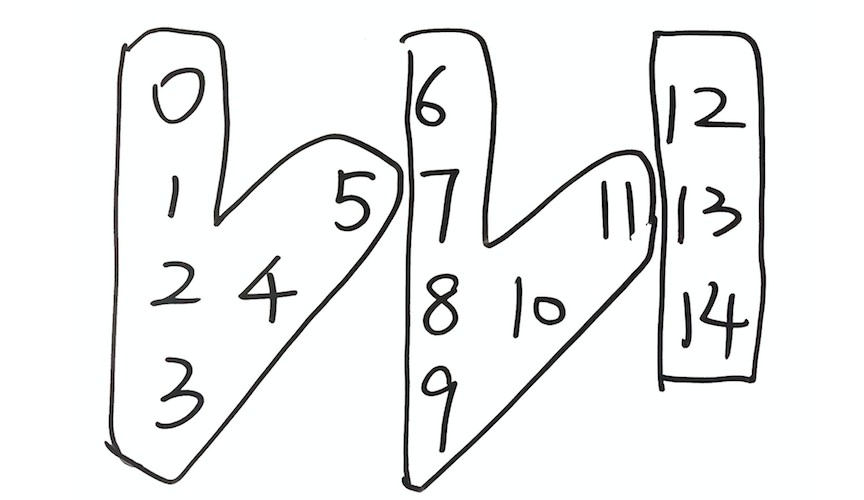

## [6. Zigzag Conversion](https://leetcode.com/problems/zigzag-conversion/)


The string `"PAYPALISHIRING"` is written in a zigzag pattern on a given number of rows like this: (you may want to display this pattern in a fixed font for better legibility)

```
P   A   H   N
A P L S I I G
Y   I   R
```

And then read line by line: `"PAHNAPLSIIGYIR"`

Write the code that will take a string and make this conversion given a number of rows:

```
string convert(string s, int numRows);
```

**Example 1:**

```
Input: s = "PAYPALISHIRING", numRows = 3
Output: "PAHNAPLSIIGYIR"
```

**Example 2:**

```
Input: s = "PAYPALISHIRING", numRows = 4
Output: "PINALSIGYAHRPI"
Explanation:
P     I    N
A   L S  I G
Y A   H R
P     I
```

**Example 3:**

```
Input: s = "A", numRows = 1
Output: "A"
```

**Constraints:**

*   `1 <= s.length <= 1000`
*   `s` consists of English letters (lower-case and upper-case), `','` and `'.'`.
*   `1 <= numRows <= 1000`


## Solution

- Approach 1: Simulation with matrix	$Time: O(n), Space: O(n)$ 

```go
func convert(s string, numRows int) string {
    n, r := len(s), numRows
    if r == 1 || r >= n {
        return s
    }

    matrix := make([][]byte, r)
    x := 0      // current row
    down := false
    for i := range s {
        matrix[x] = append(matrix[x], s[i])
        if x == 0 || x == r-1 {
            down = !down        // flip direction
        }
        
        if down {
            x++
        } else {
            x--
        }
    }

    var sb strings.Builder
    for x := range matrix {
        sb.WriteString(string(matrix[x]))
    }
    return sb.String()
}
```


- Approach 2: Observe the pattern	$Time: O(n), Space: O(1)$ 

> When filling up the matrix, the pointer first goes down `r` steps and then going up `r-2` steps. Then it goes back to first row and start another cycle.

```go
func convert(s string, numRows int) string {
	n, r := len(s), numRows
	if r == 1 || r >= n {
		return s
	}

	t := r + (r - 2)	// t characters in each cycle
	result := make([]byte, 0, n)
	for i := 0; i < r; i++ {		// for each row
		for j := 0; j+i < n; j+=t {	// for each cycle
			// first character in current cycle (index: j+i)
			result = append(result, s[j+i])
			// second character in current cycle (index: j+t-i)
			// (except first and last line)
			if i != 0 && i != r-1 && j+t-i < n {
				result = append(result, s[j+t-i])
			}
		}
	}
	return string(result)
}
```

