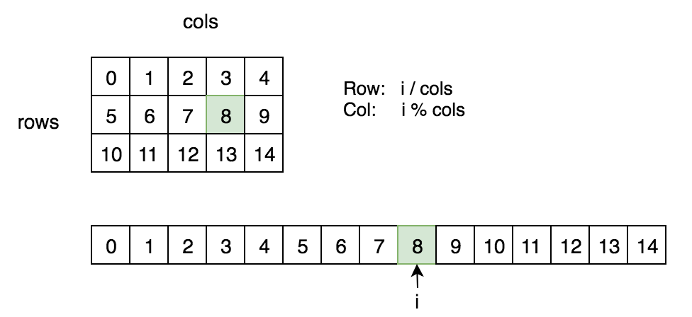

## [74. Search a 2D Matrix](https://leetcode.com/problems/search-a-2d-matrix/)


Write an efficient algorithm that searches for a value `target` in an `m x n` integer matrix `matrix`. This matrix has the following properties:

*   Integers in each row are sorted from left to right.
*   The first integer of each row is greater than the last integer of the previous row.

**Example 1:**


```
Input: matrix = [[1,3,5,7],[10,11,16,20],[23,30,34,60]], target = 3
Output: true
```

**Example 2:**


```
Input: matrix = [[1,3,5,7],[10,11,16,20],[23,30,34,60]], target = 13
Output: false
```

**Constraints:**

*   `m == matrix.length`
*   `n == matrix[i].length`
*   `1 <= m, n <= 100`
*   <code>-10<sup>4</sup> <= matrix[i][j], target <= 10<sup>4</sup></code>


## Solution

- Binary Search

> Consider the 2D matrix as a 1D array. The number of index `i` is at row `i/n` and column `i%n` .

```go
func searchMatrix(matrix [][]int, target int) bool {
    m, n := len(matrix), len(matrix[0])

    l, r := 0, m*n
    for l < r {
        mid := l + (r - l) / 2
        midVal := matrix[mid/n][mid%n]
        if midVal == target {
            return true
        }

        if midVal > target {
            r = mid
        } else {
            l = mid+1
        }
    }
    return false
}
```

