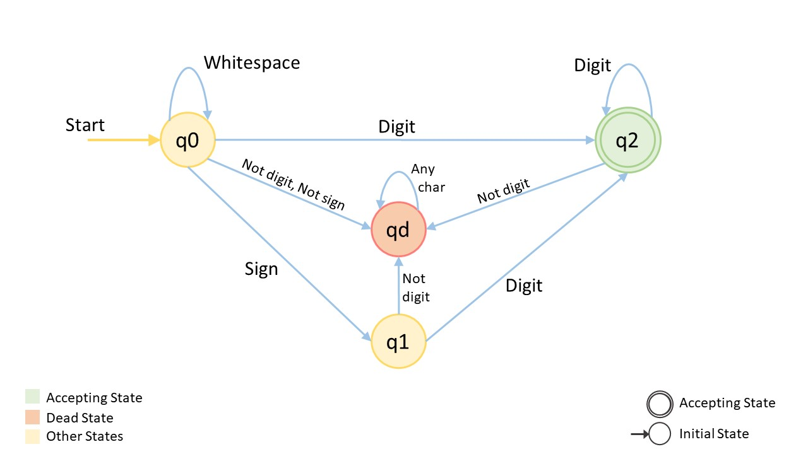

## [8. String to Integer (atoi)](https://leetcode.com/problems/string-to-integer-atoi/)


Implement the `myAtoi(string s)` function, which converts a string to a 32-bit signed integer (similar to C/C++'s `atoi` function).

The algorithm for `myAtoi(string s)` is as follows:

1.  Read in and ignore any leading whitespace.
2.  Check if the next character (if not already at the end of the string) is `'-'` or `'+'`. Read this character in if it is either. This determines if the final result is negative or positive respectively. Assume the result is positive if neither is present.
3.  Read in next the characters until the next non-digit character or the end of the input is reached. The rest of the string is ignored.
4.  Convert these digits into an integer (i.e. `"123" -> 123`, `"0032" -> 32`). If no digits were read, then the integer is `0`. Change the sign as necessary (from step 2).
5.  If the integer is out of the 32-bit signed integer range <code>[-2<sup>31</sup>, 2<sup>31</sup> - 1]</code>, then clamp the integer so that it remains in the range. Specifically, integers less than <code>-2<sup>31</sup></code> should be clamped to <code>-2<sup>31</sup></code>, and integers greater than <code>2<sup>31</sup> - 1</code> should be clamped to <code>2<sup>31</sup> - 1</code>.
6.  Return the integer as the final result.

**Note:**

*   Only the space character `' '` is considered a whitespace character.
*   **Do not ignore** any characters other than the leading whitespace or the rest of the string after the digits.

**Example 1:**

```
Input: s = "42"
Output: 42
Explanation: The underlined characters are what is read in, the caret is the current reader position.
Step 1: "42" (no characters read because there is no leading whitespace)
         ^
Step 2: "42" (no characters read because there is neither a '-' nor '+')
         ^
Step 3: "42" ("42" is read in)
           ^
The parsed integer is 42.
Since 42 is in the range [-231, 231 - 1], the final result is 42.
```

**Example 2:**

```
Input: s = "   -42"
Output: -42
Explanation:
Step 1: "   -42" (leading whitespace is read and ignored)
            ^
Step 2: "   -42" ('-' is read, so the result should be negative)
             ^
Step 3: "   -42" ("42" is read in)
               ^
The parsed integer is -42.
Since -42 is in the range [-231, 231 - 1], the final result is -42.
```

**Example 3:**

```
Input: s = "4193 with words"
Output: 4193
Explanation:
Step 1: "4193 with words" (no characters read because there is no leading whitespace)
         ^
Step 2: "4193 with words" (no characters read because there is neither a '-' nor '+')
         ^
Step 3: "4193 with words" ("4193" is read in; reading stops because the next character is a non-digit)
             ^
The parsed integer is 4193.
Since 4193 is in the range [-231, 231 - 1], the final result is 4193.
```

**Constraints:**

*   `0 <= s.length <= 200`
*   `s` consists of English letters (lower-case and upper-case), digits (`0-9`), `' '`, `'+'`, `'-'`, and `'.'`.


## Solution

- Approach 1: Follow the Rules

```go
func myAtoi(s string) int {
	n := len(s)
	result := 0
	i := 0
	// skip leading spaces
	for i < n && s[i] == ' ' {
		i++
	}
	// sign
	sign := 1
	if i < n {
		if s[i] == '+' {
			i++
		} else if s[i] == '-' {
			sign = -1
			i++
		}
	}
	// skip leading '0's
	for i < n && s[i] == '0' {
		i++
	}
	// valid digits
	for i < n && s[i] >= '0' && s[i] <= '9' {
		digit := int(s[i] - '0')
		// check overflow
		// want to check if result * 10 + digit > math.MaxInt32,
		// but since *10 and +digit both could overflow, so move them to right side
		if result > (math.MaxInt32 - digit) / 10 {
			if sign == 1 {
				return math.MaxInt32
			} else {
				return math.MinInt32
			}
		}
		result = result * 10 + digit
		i++
	}
	
	result *= sign
	return result
}
```

> Notice how we simplified "check overflow" part:
>
> ```go
> // complicated way to write this:
> if result > math.MaxInt32 / 10 || (result == math.MaxInt32 / 10 && digit > math.MaxInt32 % 10)
> 
> // it can be simplified to
> if result > (math.MaxInt32 - digit) / 10
> // want to check if result * 10 + digit > math.MaxInt32,
> // but since *10 and +digit both could overflow, so move them to right side
> 
> ```
>
> for this problem, we do NOT need to check underflow, because the corner case when `result * 10 + digit == math.MinInt32` is also covered since we have a `sign` varaiable. It will return `math.MinInt32` as expected.


- Approach 2: Deterministic Finite Automaton (DFA)

> Using DFA is a more generalized approach for complex string process problems. ( [Solution page](https://leetcode.com/problems/string-to-integer-atoi/solution/) )



```go
```

