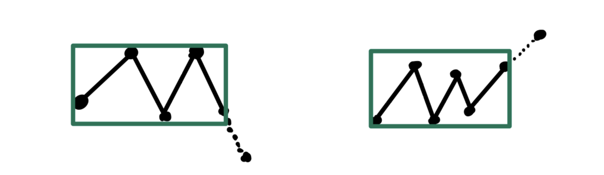

## [508 · Wiggle Sort](https://www.lintcode.com/problem/508/) 

**Description** 

Given an unsorted array `nums`, reorder it **in-place** such that

```
nums[0] <= nums[1] >= nums[2] <= nums[3]....
```

There may have multiple answers for a question, **you only need to consider one of the possibilities**.

Please sort the array in place and do not define additional arrays.

**Example** 

**Example 1:**

```
Input: [3, 5, 2, 1, 6, 4]
Output: [1, 6, 2, 5, 3, 4]
Explanation: This question may have multiple answers, and [2, 6, 1, 5, 3, 4] is also ok.
```

**Example 2:**

```
Input: [1, 2, 3, 4]
Output: [1, 4, 2, 3]
```


## Solution

- Sort then swap	$Time: O(nlogn), Space: O(logn)$ 

```java
func wiggleSort(nums []int) {
    sort.Ints(nums)
    i, j := 1, 2
    for j < len(nums) {
        // swap
        nums[i], nums[j] = nums[j], nums[i]
        i+=2; j+=2
    }
}
```


- Swap only	$Time: O(n), Space: O(1)$ 

Actually we don't need to sort the array. Just swap the elements when they don't meet "Wiggle property". As illustrated below, it won't break "Wiggle property" of previous numbers.



```go
func wiggleSort(nums []int) {
    for i := 1; i < len(nums); i++ {
        if (i%2==1 && nums[i] < nums[i-1]) ||
            (i%2==0 && nums[i] > nums[i-1]) {
            // swap
            nums[i], nums[i-1] = nums[i-1], nums[i]
        }
    }
}
```

