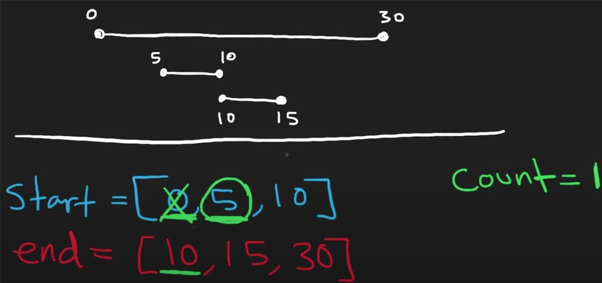

## [919 · Meeting Rooms II](https://www.lintcode.com/problem/919/) 

**Description** 

Given an array of meeting time intervals consisting of start and end times `[[s1,e1],[s2,e2],...] (si < ei)`, find the minimum number of conference rooms required.

Note: (0,8),(8,10) is not conflict at 8

**Example** 

**Example1**

```
Input: intervals = [(0,30),(5,10),(15,20)]
Output: 2
Explanation:
We need two meeting rooms
room1: (0,30)
room2: (5,10),(15,20)
```

**Example2**

```
Input: intervals = [(2,7)]
Output: 1
Explanation: 
Only need one meeting room
```


## Idea

Timeline. Count concurrent meetings at a given time.

- Start a meeting: count++
- End a meeting: count--  (**End a meeting first when there's a tie**: when a meeting starts and another meeting ends at the same time)

(Visualization from [Yt video](https://www.youtube.com/watch?v=FdzJmTCVyJU))

 


## Solution

- Timeline

```go
/**
 * Definition of Interval:
 * type Interval struct {
 *     Start, End int
 * }
 */

import "sort"

func MinMeetingRooms(intervals []*Interval) int {
    n := len(intervals)
    start := make([]int, n)
    end := make([]int, n)
    for i := range intervals {
        start[i] = intervals[i].Start
        end[i] = intervals[i].End
    }
    sort.Ints(start)
    sort.Ints(end)

    maxCount, count := 0, 0
    i, j := 0, 0
    for i < n {
        if start[i] < end[j] {
            count++
            i++
        } else {
            count--
            j++
        }
        maxCount = max(maxCount, count)
    }
    return maxCount
}

func max(x, y int) int {
    if x > y {
        return x
    }
    return y
}
```


- Heap

```go
/**
 * Definition of Interval:
 * type Interval struct {
 *     Start, End int
 * }
 */

import "container/heap"
import "sort"

func MinMeetingRooms(intervals []*Interval) int {
    n := len(intervals)
    // sort by start
    sort.Slice(intervals, func(i, j int) bool {
        return intervals[i].Start < intervals[j].Start
    })
    // MinHeap by end
    h := &Heap{}
    heap.Push(h, intervals[0])
    for i := 1; i < n; i++ {
        cur := intervals[i]
        pre := (*h)[0]      // top of heap: it has minEnd by far
        if cur.Start >= pre.End {   // does not overlap, extend time of existing room
            pre.End = cur.End
            heap.Fix(h, 0)  // fix the heap after updating its value
        } else {                    // overlap, add it to a new room
            heap.Push(h, cur)
        }
    }
    return h.Len()
}


// Heap type definition
type Heap []*Interval

func (h Heap) Len() int           { return len(h) }
func (h Heap) Less(i, j int) bool { return h[i].End < h[j].End }
func (h Heap) Swap(i, j int)      { h[i], h[j] = h[j], h[i] }

func (h *Heap) Push(x any) {
	*h = append(*h, x.(*Interval))
}

func (h *Heap) Pop() any {
	n := len(*h)
	item := (*h)[n-1]
	*h = (*h)[:n-1]
	return item
}
```

> Note: ==Remember to fix the heap after updating its value!!!== Alternatively, we can Pop -> update value -> Push back:
>
> ```go
> 	for i := 1; i < n; i++ {
>         cur := intervals[i]
>         pre := heap.Pop(h).(*Interval)	// Pop: it has minEnd by far
>         if cur.Start >= pre.End {   // does not overlap, extend time of existing room
>             pre.End = cur.End
>         } else {                    // overlap, add it to a new room
>             heap.Push(h, cur)
>         }
>         heap.Push(h, pre)	// Push back after updating its value
>     }
> ```

