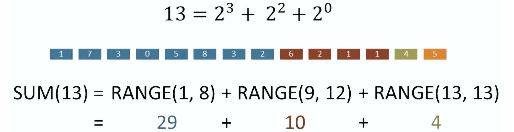

## Binary Indexed Tree

> aka. Fenwick Tree. It is 1-indexed. [YT tutorial](https://www.youtube.com/watch?v=uSFzHCZ4E-8) and [Another YT tutorial](https://www.youtube.com/watch?v=v_wj_mOAlig) that explains intuition:



```go
package main

import "fmt"

func main() {
	nums := []int{1,3,5}
	var b BIT
    b.Init(nums)
	fmt.Println(b)

	fmt.Println(b.SumRange(0,2))
	b.Update(1, 2)
	fmt.Println(b.SumRange(0,2))
}


// BIT type definition
type BIT struct {
    nums []int
    tree []int
}

func (b *BIT) Init(nums []int) {
    b.nums = nums
    b.tree = make([]int, len(nums)+1)
    for i, num := range nums {
        b.add(i+1, num)
    }
}

func (b *BIT) Update(i, val int)  {
    b.add(i+1, val-b.nums[i])
    b.nums[i] = val
}

func (b *BIT) SumRange(L, R int) int {
    return b.sum(R+1) - b.sum(L)
}

func (b *BIT) add(i, val int) {
    for i < len(b.tree) {
        b.tree[i] += val
        i += (i & -i)		// add last 1-bit
    }
}

func (b *BIT) sum(i int) int {
    sum := 0
    for i > 0 {
        sum += b.tree[i]
        i -= (i & -i)		// remove last 1-bit, equivalent to i &= i-1
    }
    return sum
}
```

