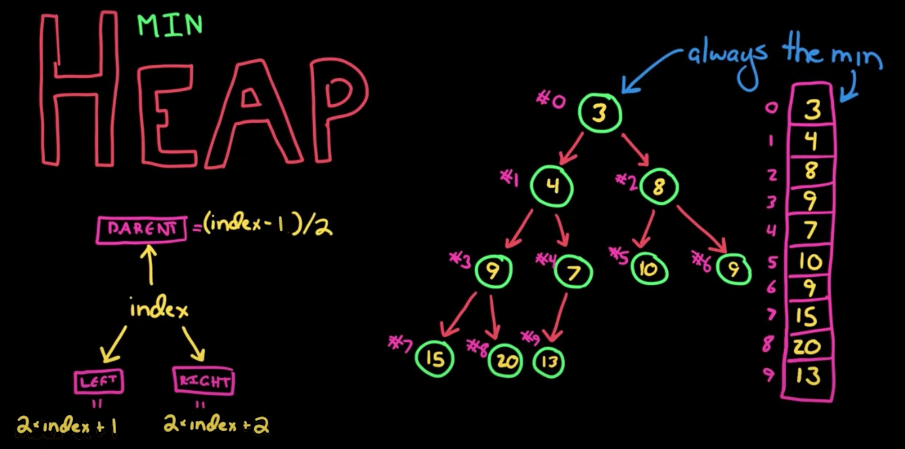
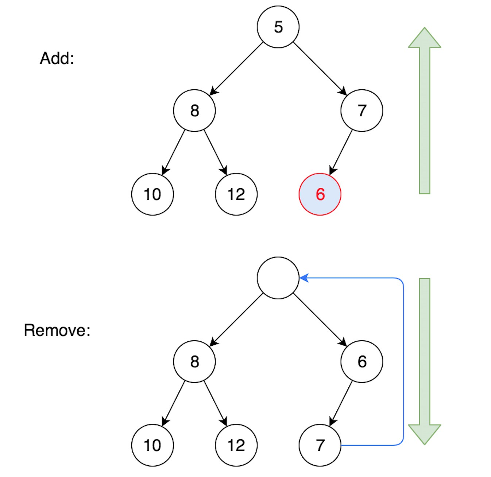

# Heap

- `Min-Heap`: The value of every node is less than or equal to its children. (Then the root node is the smallest)
- `Max-Heap`: The value of every node is greater than or equal to its children. (Then the root node is the largest)


## Major Operations

| Operation       | Description                                                  | Comment   |
| :-------------- | :----------------------------------------------------------- | --------- |
| add/offer/push  | Add to the last, then siftUp⬆︎                                | $O(logN)$ |
| peek/top        | Peek the root element                                        | $O(1)$    |
| remove/poll/pop | Remove the first element, move the last to first, then siftDown⬇︎ | $O(logN)$ |
| build a heap    | For every non-leaf node (from last to first), siftDown⬇︎      | $O(N)$    |

> The last non-leaf node is the parent of last element. The last element is at index `n-1`, and its parent `(n-1-1)/2` = `(n/2)-1`.


## Heap Indices



(Image from [HackerRank video](https://www.youtube.com/watch?v=t0Cq6tVNRBA) , with corrections on the parent index.)


## Heap Operations



Also, visit [An online visualization site by Dr. David Galles](https://www.cs.usfca.edu/~galles/visualization/Heap.html).


## Implement Min-Heap (from the ground up)

```go
package main

import "fmt"

func main() {
	//var h Heap														// Create an Empty Heap
	h := Heap{50, 60, 30, 90, 20}					 	// Create a Heap with initial values
	h.Init()
	fmt.Println(h, "size:", len(h))

	h.Push(5)
	h.Push(6)
	h.Push(3)
	h.Push(9)
	h.Push(2)
	fmt.Println(h, "size:", len(h))

	fmt.Println("Pop", h.Pop())
	fmt.Println("Pop", h.Pop())
	fmt.Println("Pop", h.Pop())
	fmt.Println(h, "size:", len(h))
}


// Heap type definition
type Heap []int

// Init a heap: for every non-leaf node (from last to first), siftDown
func (h *Heap) Init() {
	n := len(*h)
	for i := n/2-1; i >= 0; i-- {
		h.siftDown(i)
	}
}

// Push to the last, then siftUp
func (h *Heap) Push(x int) {
	*h = append(*h, x)
	h.siftUp(len(*h)-1)
}

// Pop the first element, move the last to first, then siftDown
func (h *Heap) Pop() int {
	n := len(*h)
	first, last := (*h)[0], (*h)[n-1]
	(*h)[0] = last
	*h = (*h)[:n-1]
	h.siftDown(0)
	return first
}

func (h *Heap) Top() int {
	return (*h)[0]
}


func (h *Heap) siftUp(index int) {
	// as long as it has parent
	for index > 0 {
		parent := (index-1)/2
		if (*h)[parent] <= (*h)[index] {
			break
		}
		// swap them and then move up
		(*h)[parent], (*h)[index] = (*h)[index], (*h)[parent]
		index = parent
	}
}

func (h *Heap) siftDown(index int) {
	n := len(*h)
	// as long as it has left child
	for 2*index+1 < len(*h) {
		// get the smaller child
		left := 2*index+1
		right := 2*index+2	// may not exist
		smallerChild := left
		if right < n && (*h)[right] < (*h)[left] {
			smallerChild = right
		}

		if (*h)[index] <= (*h)[smallerChild] {
			break
		}
		// swap them and then move down
		(*h)[index], (*h)[smallerChild] = (*h)[smallerChild], (*h)[index]
		index = smallerChild
	}
}
```


## Min-Heap using `container/heap` library

> ⚠️ Use the top-level functions `heap.Init/Push/Pop` instead of `h.Push/Pop` !!!
>
> - `Len/Less/Swap` are interface methods defined in `sort` .
> - `Push/Pop` are interface methods definied in `container/heap` 
>
> ⚠️ To make it a Max-Heap (or PriorityQueue), simply override the `Less` function.


🍺 For basic item types such as `int`, we can embed `sort.IntSlice` into our Heap struct, so that its `Len/Less/Swap` functions are automatically included.

```go
func main() {
  h := &Heap{[]int{50, 60, 30, 90, 20}}
  // ...
}


// Heap type definition
type Heap struct {
	sort.IntSlice
}

// Push and Pop must use "any" to conform with the interface defined in container/heap.
func (h *Heap) Push(x any) {
	h.IntSlice = append(h.IntSlice, x.(int))
}

func (h *Heap) Pop() any {
	a := h.IntSlice
	x := a[len(a)-1]
	h.IntSlice = a[:len(a)-1]
	return x
}
```


🍺 For complex item types, we need to implemente all the methods.

```go
package main

import (
	"container/heap"
	"fmt"
)

func main() {
	values := []int{50, 60, 30, 90, 20}
	h := &Heap{}
	for _, v := range values {
		*h = append(*h, &Item{v})
	}
	heap.Init(h)	// O(n)
	fmt.Println(h, "size:", h.Len())

	// Note: Use the top-level `heap.Push/Pop` functions instead of `h.Push/Pop` !!!
	nums := []int{5, 6, 3, 9, 2}
	for _, v := range nums {
		heap.Push(h, &Item{v})
	}
	fmt.Println(h, "size:", h.Len())

	fmt.Println("Pop", heap.Pop(h).(*Item))
	fmt.Println("Pop", heap.Pop(h).(*Item))
	fmt.Println("Pop", heap.Pop(h).(*Item))
	fmt.Println(h, "size:", h.Len())
}

type Item struct {
	v int
	// (any other fields...)
}

// String method is optional here.
func (i Item) String() string {
	return fmt.Sprintf("%d", i.v)
}

// Heap type definition
type Heap []*Item

func (h Heap) Len() int           { return len(h) }
func (h Heap) Less(i, j int) bool { return h[i].v < h[j].v }
func (h Heap) Swap(i, j int)      { h[i], h[j] = h[j], h[i] }

// Push and Pop must use "any" to conform with the interface defined in container/heap.
func (h *Heap) Push(x any) {
	*h = append(*h, x.(*Item))
}

func (h *Heap) Pop() any {
	n := len(*h)
	item := (*h)[n-1]
	*h = (*h)[:n-1]
	return item
}
```

