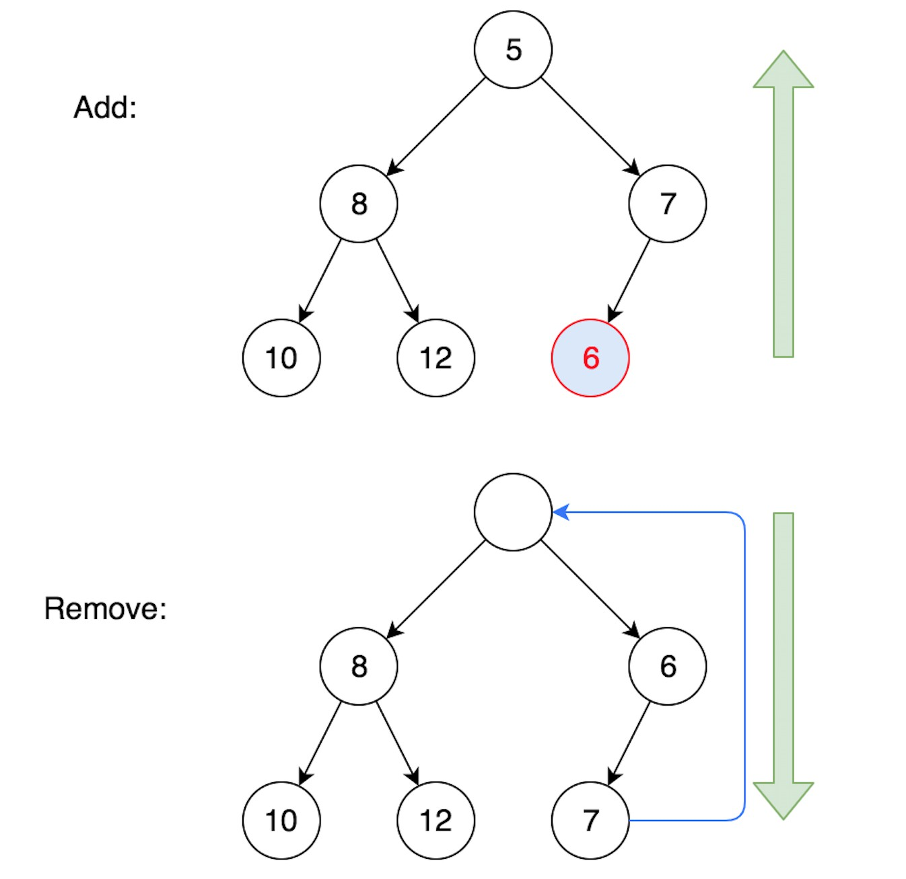

# Heap

- `Min-Heap`: The value of every node is less than or equal to its children. (Then the root node is the smallest)
- `Max-Heap`: The value of every node is greater than or equal to its children. (Then the root node is the largest)


## Major Operations

| Operation       | Description                                                  |
| :-------------- | :----------------------------------------------------------- |
| add/offer/push  | Add to the last, then siftUp⬆︎                                |
| remove/poll/pop | Remove the first element, move the last to first, then siftDown⬇︎ |
| build a heap    | For every non-leaf node (from last to first), siftDown⬇︎      |

> The last non-leaf node is the parent of last element. The last element is at index `n-1`, and its parent `(n-1-1)/2` = `(n/2)-1`.


## Visualization



Also, visit [An online visualization site by Dr. David Galles](https://www.cs.usfca.edu/~galles/visualization/Heap.html).


## Implement Min-Heap (from the ground up)

```go
package main

import "fmt"

func main() {
	//var h Heap														// Create an Empty Heap
	h := Heap{50, 60, 30, 90, 20}					 	// Create a Heap with initial values
	h.Init()
	fmt.Println(h, "size:", len(h))

	h.Push(5)
	h.Push(6)
	h.Push(3)
	h.Push(9)
	h.Push(2)
	fmt.Println(h, "size:", len(h))

	fmt.Println("Pop", h.Pop())
	fmt.Println("Pop", h.Pop())
	fmt.Println("Pop", h.Pop())
	fmt.Println(h, "size:", len(h))
}


// Heap type definition
type Heap []int

// Init a heap: for every non-leaf node (from last to first), siftDown
func (h *Heap) Init() {
	n := len(*h)
	for i := n/2-1; i >= 0; i-- {
		h.siftDown(i)
	}
}

// Push to the last, then siftUp
func (h *Heap) Push(x int) {
	*h = append(*h, x)
	h.siftUp(len(*h)-1)
}

// Pop the first element, move the last to first, then siftDown
func (h *Heap) Pop() int {
	n := len(*h)
	first, last := (*h)[0], (*h)[n-1]
	(*h)[0] = last
	*h = (*h)[:n-1]
	h.siftDown(0)
	return first
}

func (h *Heap) Top() int {
	return (*h)[0]
}


func (h *Heap) siftUp(index int) {
	// as long as it has parent
	for index > 0 {
		parent := (index-1)/2
		if (*h)[parent] <= (*h)[index] {
			break
		}
		// swap them and then move up
		(*h)[parent], (*h)[index] = (*h)[index], (*h)[parent]
		index = parent
	}
}

func (h *Heap) siftDown(index int) {
	n := len(*h)
	// as long as it has left child
	for 2*index+1 < len(*h) {
		// get the smaller child
		left := 2*index+1
		right := 2*index+2	// may not exist
		smallerChild := left
		if right < n && (*h)[right] < (*h)[left] {
			smallerChild = right
		}

		if (*h)[index] <= (*h)[smallerChild] {
			break
		}
		// swap them and then move down
		(*h)[index], (*h)[smallerChild] = (*h)[smallerChild], (*h)[index]
		index = smallerChild
	}
}
```


## Min-Heap using `container/heap` library

> ⚠️ Its API is confusing. Use the top-level functions `heap.Push/Pop` instead of `h.Push/Pop` !!!
>
> - `Len/Less/Swap` are interface methods defined in `sort` 
> - `Push/Pop` are interface methods definied in `container/heap` 

```go
package main

import (
	"container/heap"
	"fmt"
)

func main() {
	h := &IntHeap{50, 60, 30, 90, 20}
	heap.Init(h)
	fmt.Println(h, "size:", h.Len())

  // Note: Use the top-level `heap.Push/Pop` functions instead of `h.Push/Pop` !!!
	heap.Push(h,5)
	heap.Push(h,6)
	heap.Push(h,3)
	heap.Push(h,9)
	heap.Push(h,2)
	fmt.Println(h, "size:", h.Len())

	fmt.Println("Pop", heap.Pop(h).(int))
	fmt.Println("Pop", heap.Pop(h).(int))
	fmt.Println("Pop", heap.Pop(h).(int))
	fmt.Println(h, "size:", h.Len())
}


// IntHeap type definition
type IntHeap []int

func (h IntHeap) Len() int           { return len(h) }
func (h IntHeap) Less(i, j int) bool { return h[i] < h[j] }
func (h IntHeap) Swap(i, j int)      { h[i], h[j] = h[j], h[i] }

// Push and Pop use pointer receivers because they modify the slice's length, not just its contents.
// Note: the type must be "any" to conform with the interface defined in container/heap.
func (h *IntHeap) Push(x any) {
	*h = append(*h, x.(int))
}

func (h *IntHeap) Pop() any {
	n := len(*h)
	x := (*h)[n-1]
	*h = (*h)[:n-1]
	return x
}
```


## Max-Heap / PriorityQueue using `container/heap` library

> A `PriorityQueue` is just a `Max-Heap`.

A less efficient approach for [347. Top K Frequent Elements](https://leetcode.com/problems/top-k-frequent-elements/) , but useful to demonstrate how to use Heap/PriorityQueue in Go.

```go
import "container/heap"

func topKFrequent(nums []int, k int) []int {
	count := make(map[int]int)
	for _, num := range nums {
		count[num]++
	}

	q := new(PriorityQueue)
	for num, c := range count {
		*q = append(*q, &Item{num, c})
	}
	heap.Init(q)	// O(n)

	var result []int
	for i := 0; i < k; i++ {
		top := heap.Pop(q).(*Item)
		result = append(result, top.num)
	}
	return result
}


type Item struct {
	num		int
	count	int
}

// A PriorityQueue implements heap.Interface and holds Items.
type PriorityQueue []*Item

func (q PriorityQueue) Len() int {
	return len(q)
}
func (q PriorityQueue) Less(i, j int) bool {
	return q[i].count > q[j].count	// making it a MaxHeap for count
}
func (q PriorityQueue) Swap(i, j int) {
	q[i], q[j] = q[j], q[i]
}

func (q *PriorityQueue) Push(x any) {
	item := x.(*Item)
	*q = append(*q, item)
}

func (q *PriorityQueue) Pop() any {
	n := len(*q)
	item := (*q)[n-1]
	*q = (*q)[:n-1]
	return item
}
```

