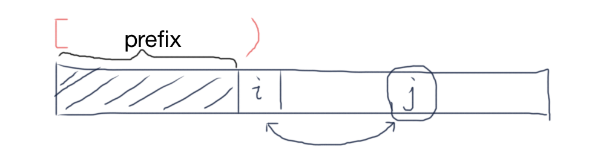

# GenerateStrings and Permutations

> permuta(nums) = generateStrings(nums, n) without re-using same elements.


## Q1: generateStrings(alphabet, k)

> Allow re-using same elements.

- Input: an alphabet containing **distinct** elements, and an integer `k` 
- Output: All strings of length `k` generated with the `alphabet` 

Example:

```
Input: alphabet="123", k=2
Output: [11, 12, 13, 21, 22, 23, 31, 32, 33]
```

Example2:

```
Input: alphabet="123", k=3
Output: [111, 112, 113, 121, 122, 123, 131, 132, 133, 211, 212, 213, 221, 222, 223, 231, 232, 233, 311, 312, 313, 321, 322, 323, 331, 332, 333]
```

**Solution** 

```go
func main() {
	alphabet := "123"
	k := 3
	fmt.Println(generateStrings(alphabet, k))
}

func generateStrings(alphabet string, k int) []string {
	var result []string
	helper(alphabet, k, []byte{}, &result)
	return result
}

func helper(alphabet string, k int, prefix []byte, result *[]string) {
	if len(prefix) == k {
		*result = append(*result, string(prefix))
		return
	}

	for i := range alphabet {
		// generate all strings that start with A[i]
		prefix = append(prefix, alphabet[i])
		helper(alphabet, k, prefix, result)
		prefix = prefix[:len(prefix)-1]		// clean up - restore the value of `prefix`
	}
}
```

> For prefix, use `[]byte`. Don't use `strings.Builder` because it has no way to delete last element.


## Q2: permute(nums) ( [46. Permutations](https://leetcode.com/problems/permutations/) )

- Input: an integer array with **distinct** elements
- Output: All permutations of these elements

Example:

```
Input: nums = [1,2,3]
Output: [[1, 2, 3], [1, 3, 2], [2, 1, 3], [2, 3, 1], [3, 1, 2], [3, 2, 1]]
```

**Solution** 

- Approach 1 (Recommended)

> This approach also fits into the variant problem: "get all permutations of length k", only need to change n to k in the code.

```go
func permute(nums []int) [][]int {
    var result [][]int
    var prefix []int
    used := make([]bool, len(nums))
    helper(nums, prefix, &result, used)
    return result
}

func helper(nums []int, prefix []int, result *[][]int, used []bool) {
    n := len(nums)
    if len(prefix) == n {
        // add prefix to result
        tmp := make([]int, n)
        copy(tmp, prefix)
        *result = append(*result, tmp)
        return
    }

    for i := range nums {
        if used[i] { // avoid dups
            continue
        }
        // generate all permutations that start with nums[i]
        prefix = append(prefix, nums[i])
        used[i] = true
        helper(nums, prefix, result, used)
        // cleanup - restore the states
        prefix = prefix[:len(prefix)-1]
        used[i] = false
    }
}
```

- Approach 2: Swap

> Instead of using an additional array to store prefix, we can use a pointer `i` and `A[0..i)` stands for prefix. The prefix can then be extended by swapping values in `A[i:]` with `A[i]`.



```go
func permute(nums []int) [][]int {
	var result [][]int
	helper(nums, 0, &result)
	return result
}

// A[0..i) is fixed, i.e. prefix = A[0..i)
// then permute A[i:]
func helper(nums []int, i int, result *[][]int) {
	n := len(nums)
	if i == n {
		// add prefix to result (as i == n, prefix is the whole array)
		tmp := make([]int, n)
		copy(tmp, nums)
		*result = append(*result, tmp)
		return
	}

	for j := i; j < n; j++ {
		// swap values at i and j
		nums[i], nums[j] = nums[j], nums[i]
		// extend prefix, then permute A[i+1:]
		helper(nums, i+1, result)
		// clean up: restore states
		nums[i], nums[j] = nums[j], nums[i]
	}
}
```

- Approach 3: Insert (Not recommended - Very error-prone)

```go
func permute(nums []int) [][]int {
    var perms [][]int
    perms = append(perms, []int{})
    
    // for every new number
    for _, v := range nums {
        var new_perms [][]int
        // for every existing permutation
        for _, p := range perms {
            // for every insert position
            for i := 0; i <= len(p); i++ {
                // make a copy, and insert v
                p_copy := make([]int, len(p))
                copy(p_copy, p)
                p_copy = slices.Insert(p_copy, i, v)
                new_perms = append(new_perms, p_copy)
            }
        }
        perms = new_perms
    }
    return perms
}
```


## Q3: permute(nums) with dups ( [47. Permutations II](https://leetcode.com/problems/permutations-ii/) )

- Input: an integer array which may contains duplicates
- Output: All permutations of these elements

Example:

```
Input: nums = [2, 2, 3]
Output: [[2, 2, 3], [2, 3, 2], [3, 2, 2]]
```

**Solution** 

- Approach 1: Sorting

```go
func permuteUnique(nums []int) [][]int {
	sort.Ints(nums)		// sort nums
    var result [][]int
    var prefix []int
    used := make([]bool, len(nums))
    helper(nums, prefix, &result, used)
    return result
}

func helper(nums []int, prefix []int, result *[][]int, used []bool) {
    n := len(nums)
    if len(prefix) == n {
        // add prefix to result
        tmp := make([]int, n)
        copy(tmp, prefix)
        *result = append(*result, tmp)
        return
    }

    for i := range nums {
        if used[i] || (i > 0 && !used[i-1] && nums[i] == nums[i-1]) { // avoid dups
            continue
        }
        // generate all permutations that start with nums[i]
        prefix = append(prefix, nums[i])
        used[i] = true
        helper(nums, prefix, result, used)
        // cleanup - restore the states
        prefix = prefix[:len(prefix)-1]
        used[i] = false
    }
}
```

- Approach 2: Swap

> Instead of using an additional array to store prefix, we can use a pointer `i` and `A[0..i)` stands for prefix. The prefix can then be extended by swapping values in `A[i:]` with `A[i]`.

```go
func permuteUnique(nums []int) [][]int {
    var result [][]int
    helper(nums, 0, &result)
    return result
}

// A[0..i) is fixed, i.e. prefix = A[0..i)
// then permute A[i:]
func helper(nums []int, i int, result *[][]int) {
    n := len(nums)
    if i == n {
        // add prefix to result (as i == n, prefix is the whole array)
        tmp := make([]int, n)
        copy(tmp, nums)
        *result = append(*result, tmp)
        return
    }

    // consider position i, we should not put same number twice at this position
    // use a set to store values in A[i..n)
    set := make(map[int]bool)
    for j := i; j < n; j++ {
        if set[nums[j]] {		// avoid dups
            continue
        }

        // swap values at i and j, extend prefix
        nums[i], nums[j] = nums[j], nums[i]
        set[nums[i]] = true
        // then permute A[i+1:]
        helper(nums, i+1, result)
        // clean up: restore states
        nums[i], nums[j] = nums[j], nums[i]
    }
}
```

- Approach 3: Counting

> Convert `nums` array into `count` map, then the keys will not have duplicates.

```go
func permuteUnique(nums []int) [][]int {
    n := len(nums)
    count := make(map[int]int)
    for _, num := range nums {
        count[num]++
    }
    var result [][]int
    var prefix []int
    helper(n, count, prefix, &result)
    return result
}

func helper(n int, count map[int]int, prefix []int, result *[][]int) {
    if len(prefix) == n {
        // add prefix to result
        tmp := make([]int, n)
        copy(tmp, prefix)
        *result = append(*result, tmp)
        return
    }

    for num := range count {
        if count[num] <= 0 {
            continue
        }
        // generate all permutations that start with num
        prefix = append(prefix, num)
        count[num]--
        helper(n, count, prefix, result)
        // cleanup - restore the states
        prefix = prefix[:len(prefix)-1]
        count[num]++
    }
}
```

