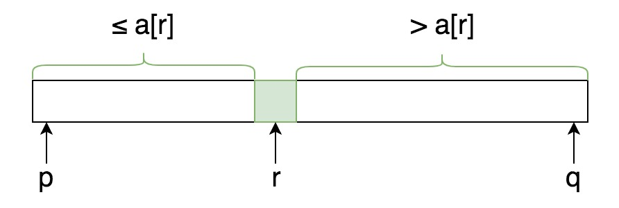

## Quicksort

First partition `nums` into two parts, then sort them by recursive calls.



`partition` function:


```go
func main() {
	nums := []int{3,1,2,7,0}
	quicksort(nums)
	fmt.Println(nums)
}

func quicksort(nums []int) {
	qsort(nums, 0, len(nums)-1)
}

func qsort(nums []int, p, q int) {
	if p >= q {
		return
	}

	r := partition(nums, p, q)
	qsort(nums, p, r-1)
	qsort(nums, r+1, q)
}

// A[p..r) always contains elements that are <= pivot
// Start with r = p, if A[i] <= pivot, then swap A[i] with A[r] and increment r
// Lastly, swap pivot to position r
func partition(nums []int, p, q int) int {
	r := p
	pivot := nums[q]	// here choose last element as pivot
	for i := p; i < q; i++ {
		if nums[i] <= pivot {
			nums[i], nums[r] = nums[r], nums[i]
			r++
		}
	}
	// swap pivot to right position 'r'
	nums[q], nums[r] = nums[r], nums[q]
	return r
}
```


## getKthElement

Get kth smallest element of `nums`. (k is 0-based)

> Make use of partition function, then use binary search.

- Recusive

```go
func getKthElement(nums []int, k int) int {
	return helper(nums, k, 0, len(nums)-1)
}

func helper(nums []int, k int, p, q int) int {
	r := partition(nums, p, q)
	if r == k {
		return nums[r]
	} else if r > k {
		return helper(nums, k, p, r-1)
	} else {
		return helper(nums, k, r+1, q)
	}
}

// A[p..r) always contains elements that are <= pivot
// Start with r = p, if A[i] <= pivot, then swap A[i] with A[r] and increment r
// Lastly, swap pivot to position r
func partition(nums []int, p, q int) int {
	r := p
	pivot := nums[q]	// here choose last element as pivot
	for i := p; i < q; i++ {
		if nums[i] <= pivot {
			nums[i], nums[r] = nums[r], nums[i]
			r++
		}
	}
	// swap pivot to right position 'r'
	nums[q], nums[r] = nums[r], nums[q]
	return r
}
```

- Iterative

```go
func getKthElement(nums []int, k int) int {
	// A[low..high)
	low, high := 0, len(nums)
	for low < high {
		r := partition(nums, low, high-1)
		if r == k {
			return nums[r]
		}

		if r > k {
			high = r
		} else {
			low = r + 1
		}
	}
	return -1
}
```

Time Complexity:

$n + n/2 + n/4 + ... + n/n = 2n-1 = O(n)$ 
