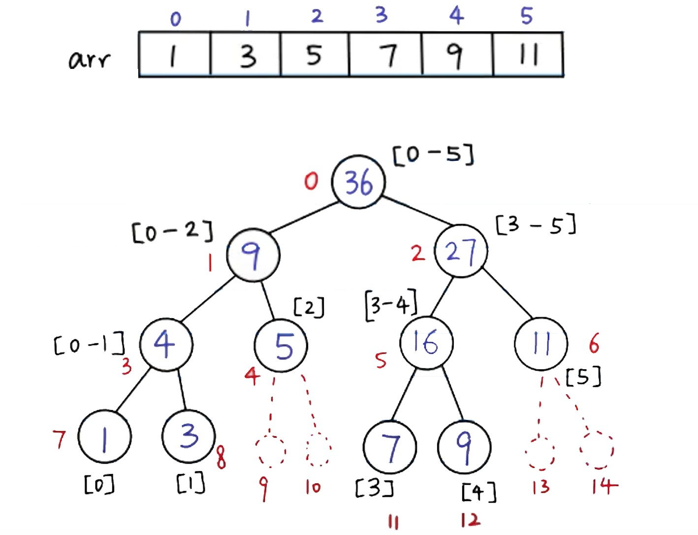

# SegmentTree and Binary Indexed Tree

## SegmentTree

(Image from [Youtube video](https://www.youtube.com/watch?v=e_bK-dgPvfM&t=1732s)) 



> [Why does 4 * N space have to be allocated for a segment tree, where N is the size of the original array?](https://www.quora.com/Why-does-4-*-N-space-have-to-be-allocated-for-a-segment-tree-where-N-is-the-size-of-the-original-array) 
>
> For array `A` of size `n` , the segment tree `st` has `2n-1` non-empty nodes. But it is a **full binary tree** , the actual space we need:
>
> |                          | Actual space needed                                          | Tree height |
> | ------------------------ | ------------------------------------------------------------ | ----------- |
> | if `n` is power of 2     | $S(n) = 2n-1$                                                | $log_2 n$   |
> | if `n` is NOT power of 2 | $S(n) = 2x-1$, where $x > n$ is <br />next integer that is power of 2. | $log_2 x$   |
>
> For example,
>
> - if `n` is power of 2, `st` will have `2n-1` nodes (`n` leaf nodes and `n-1` internal nodes)
> - if we increase only 1 element to `A` , `st` gets doubled. (`n` leaf nodes, `n-1` internal nodes, and `2(n-1)-2` nodes are unused. -- Close to `4n` (upper bound) nodes in total.)
>
> Conclusion without proof: ==4 is the smallest $k$ that it's safe to assume the space is sufficient for usage==.

```go
package main

import "fmt"

func main() {
	nums := []int{1,3,5}
	n := len(nums)

	s := make(ST, n*4)
	s.build(nums, 0, 0, n-1)
	fmt.Println(s)

	fmt.Println(s.sum(0, 2, 0, 0, n-1))
	s.update(1, 2, 0, 0, n-1)
	fmt.Println(s.sum(0, 2, 0, 0, n-1))
}


// ST type definition
type ST []int

func (s ST) build(nums []int, node, start, end int) {
	if start == end {
		s[node] = nums[start]
		return
	}
	leftNode, rightNode := 2*node+1, 2*node+2
	mid := (start+end)/2
	s.build(nums, leftNode, start, mid)
	s.build(nums, rightNode, mid+1, end)
	s[node] = s[leftNode] + s[rightNode]
}

func (s ST) update(i, val int, node, start, end int) {
	if start == end {
		s[node] = val
		return
	}
	leftNode, rightNode := 2*node+1, 2*node+2
	mid := (start+end)/2
	if i <= mid {
		s.update(i, val, leftNode, start, mid)
	} else {
		s.update(i, val, rightNode, mid+1, end)
	}
	s[node] = s[leftNode] + s[rightNode]
}

func (s ST) sum(L, R int, node, start, end int) int {
	if L == start && R == end {
		return s[node]
	}
	leftNode, rightNode := 2*node+1, 2*node+2
	mid := (start+end)/2
	if R <= mid {
		return s.sum(L, R, leftNode, start, mid)
	}
	if L > mid {
		return s.sum(L, R, rightNode, mid+1, end)
	}
	return s.sum(L, mid, leftNode, start, mid) + s.sum(mid+1, R, rightNode, mid+1, end)
}
```


## Binary Indexed Tree

> aka. **Fenwick Tree**. ==It is 1-indexed==. The position of last 1-bit determines the # of cells included.

```go
package main

import "fmt"

func main() {
    nums := []int{1,3,5}
	n := len(nums)

    b := make(BIT, n+1)
	b.Init(nums)
    fmt.Println(b)

    fmt.Println(b.SumRange(0,2))
    b.Update(1, 2, nums)
    fmt.Println(b.SumRange(0,2))
}


// BIT type definition
type BIT []int

func (b BIT) Init(nums []int) {
	copy(b[1:], nums)	// BIT is 1-indexed
	for i := 1; i < len(b); i++ {
		parent := i + (i & -i)
		if parent < len(b) {
			b[parent] += b[i]
		}
	}
}

func (b BIT) Update(i, val int, nums []int) {
	b.add(i+1, val-nums[i])
}

func (b BIT) SumRange(L, R int) int {
	return b.sum(R+1) - b.sum(L)
}

// add val to ith element (1-indexed)
func (b BIT) add(i, val int) {
	for i < len(b) {
		b[i] += val
		i += (i & -i)		// add last 1-bit
	}
}

// sum B[1...i] (i-indexed)
func (b BIT) sum(i int) int {
	sum := 0
	for i > 0 {
		sum += b[i]
		i -= (i & -i)		// remove last 1-bit (equivalent to i &= i-1)
	}
	return sum
}
```

> The `Init` function takes $O(n)$ time, but following one takes $O(nlogn)$ time:
>
> ```go
> func (b BIT) Init(nums []int) {
> 	for i, num := range nums {
> 		b.add(i+1, num)
> 	}
> }
> ```


---

**Appendix** 

---

## Segment Tree with more Encapsulation

```go
package main

import "fmt"

func main() {
	nums := []int{1,3,5}
	var s ST
	s.Init(nums)
	fmt.Println(s)

	fmt.Println(s.SumRange(0,2))
	s.Update(1, 2)
	fmt.Println(s.SumRange(0,2))
}


// ST type definition
type ST struct {
	nums []int
	tree []int
}

// Init
func (s *ST) Init(nums []int) {
	n := len(nums)
	s.nums = nums
	s.tree = make([]int, n*4)
	s.build(0, 0, n-1)
}

// Update nums[i]
func (s *ST) Update(i, val int) {
	s.update(i, val, 0, 0, len(s.nums)-1)
}

// SumRange nums[L...R] inclusive
func (s *ST) SumRange(L, R int) int {
	return s.sum(L, R, 0, 0, len(s.nums)-1)
}

func (s *ST) build(node, start, end int) {
	if start == end {
		s.tree[node] = s.nums[start]
		return
	}
	leftNode, rightNode := 2*node+1, 2*node+2
	mid := (start+end)/2
	s.build(leftNode, start, mid)
	s.build(rightNode, mid+1, end)
	s.tree[node] = s.tree[leftNode] + s.tree[rightNode]
}

func (s *ST) update(i, val int, node, start, end int) {
	if start == end {
		s.nums[i] = val
		s.tree[node] = val
		return
	}
	leftNode, rightNode := 2*node+1, 2*node+2
	mid := (start+end)/2
	if i <= mid {
		s.update(i, val, leftNode, start, mid)
	} else {
		s.update(i, val, rightNode, mid+1, end)
	}
	s.tree[node] = s.tree[leftNode] + s.tree[rightNode]
}

func (s *ST) sum(L, R int, node, start, end int) int {
	if L == start && R == end {
		return s.tree[node]
	}
	leftNode, rightNode := 2*node+1, 2*node+2
	mid := (start+end)/2
	if R <= mid {
		return s.sum(L, R, leftNode, start, mid)
	}
	if L > mid {
		return s.sum(L, R, rightNode, mid+1, end)
	}
	return s.sum(L, mid, leftNode, start, mid) + s.sum(mid+1, R, rightNode, mid+1, end)
}
```


## Binary Indexed Tree with more Encapsulation

```go
package main

import "fmt"

func main() {
    nums := []int{1,3,5}
    var b BIT
    b.Init(nums)
    fmt.Println(b)

    fmt.Println(b.SumRange(0,2))
    b.Update(1, 2)
    fmt.Println(b.SumRange(0,2))
}


// BIT type definition
type BIT struct {
    nums []int
    tree []int
}

func (b *BIT) Init(nums []int) {
    b.nums = nums
    b.tree = make([]int, len(nums)+1)
    for i, num := range nums {
        b.add(i+1, num)
    }
}

func (b *BIT) Update(i, val int)  {
    b.add(i+1, val-b.nums[i])
    b.nums[i] = val
}

func (b *BIT) SumRange(L, R int) int {
    return b.sum(R+1) - b.sum(L)
}

func (b *BIT) add(i, val int) {
    for i < len(b.tree) {
        b.tree[i] += val
        i += (i & -i)		// add last 1-bit
    }
}

func (b *BIT) sum(i int) int {
    sum := 0
    for i > 0 {
        sum += b.tree[i]
        i -= (i & -i)		// remove last 1-bit, equivalent to i &= i-1
    }
    return sum
}
```

> The `Init` function takes $O(nlogn)$ time, but it is possible to make it $O(n)$ 
>
> ```go
> func (b *BIT) Init(nums []int) {
>     b.nums = nums
>     n := len(nums)
>     b.tree = make([]int, n+1)
>     copy(b.tree[1:], b.nums)
>     for i := 1; i <= n; i++ {
>         parent := i + (i & -i)
>         if parent <= n {
>             b.tree[parent] += b.tree[i]
>         }
>     }
> }
> ```

